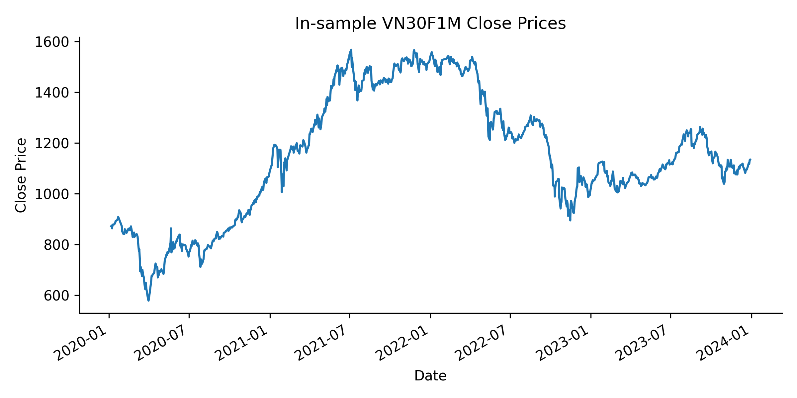
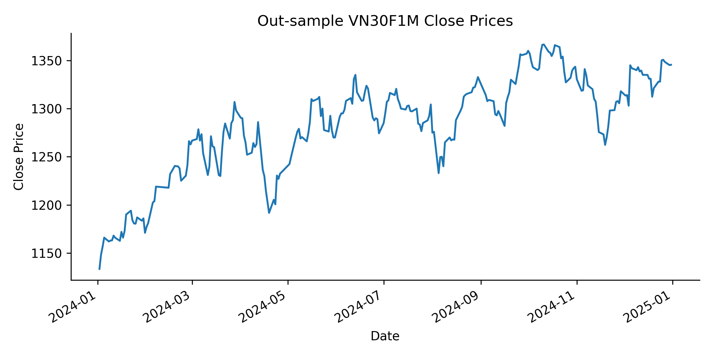

# Plutus Project Template

Template repository of a Plutus Project.

This templte project sturcture also specifies how to store and structure the source code and report of a standard Plutus Project.

This `README.md` file serves as an example how a this will look like in a standard Plutus project. Below listed out the sample section.

## Abstract
- Summarize the project: motivation, methods, findings, etc. 

## Introduction
- Briefly introduce the project.
- Problem statement, research question or the hypothesis.
- Method(s) to solve the problem
- What are the results?

## Related Work (or Background)
- Prerequisite reading if the audience needs knowledge before exploring the project.
- Optional

## Trading (Algorithm) Hypotheses
- Describe the Trading Hypotheses
- Step 1 of the Nine-Step

## Data
- **Data Source**: Historical VN30F1M index data fetched via the `vnstock`, provided by TCBS (Techcom Securities).
- **Data Type**: Daily OHLC (Open, High, Low, Close) prices.
- **Data Period**: January 1, 2020, to January 1, 2025.
  - **In-sample**: 2020-01-01 to 2024-01-01 (for strategy development and optimization).
  - **Out-of-sample**: 2024-01-01 to 2025-01-01 (for validation on unseen data).
- **Input Data**: Data is fetched programmatically via the `Vnstock().stock(symbol="VN30F1M", source="TCBS").quote.history()` function for VN30F1M futures.
- **Output Data**: Processed data stored in pandas DataFrames for analysis and backtesting.
    - **In-memory**: Stored as pandas DataFrames during script execution for efficient computation and analysis.
    - **Persistent Storage**: Saved to Excel files (`in_sample_VN30F1M.xlsx`, `out_sample_VN30F1M.xlsx`) for future use and reference.
### Data collection
- **Process**: The `load_and_preprocess_data()` function fetches raw OHLC data for VN30F1M via the `vnstock`, splitting it into in-sample and out-of-sample periods based on the specified date range.
```python
def load_and_preprocess_data(symbol, start_date='2020-01-01', end_date='2025-01-01', split_date='2024-01-01'):
    """
    Load and preprocess VN30F1M or VN30 data from vnstock API.

    Parameters:
    - symbol (str): Ticker symbol ('VN30F1M' for futures).
    - start_date (str): Start date for data retrieval (format: 'YYYY-MM-DD').
    - end_date (str): End date for data retrieval (format: 'YYYY-MM-DD').
    - split_date (str): Date to split in-sample and out-of-sample data (format: 'YYYY-MM-DD').

    Returns:
    - tuple: (in_sample_df, out_sample_df)
        - in_sample_df (pd.DataFrame): Preprocessed in-sample data with OHLC columns.
        - out_sample_df (pd.DataFrame): Preprocessed out-of-sample data with OHLC columns.
    """
    # Initialize vnstock client
    stock = Vnstock().stock(symbol=symbol, source='TCBS')

    # Fetch historical OHLC data
    try:
        data = stock.quote.history(start=start_date, end=end_date)
    except Exception as e:
        raise ValueError(f"Failed to fetch data for {symbol}: {str(e)}")

    # Standardize column names (capitalize first letter)
    data = data.rename(columns=lambda x: x.capitalize())

    # Convert 'Time' column to datetime and set as index
    data['Time'] = pd.to_datetime(data['Time'])
    data = data.sort_values('Time').set_index('Time')

    # Remove duplicates and handle missing values
    data = data.drop_duplicates()
    data = data.dropna(subset=['Open', 'High', 'Low', 'Close'])

    # Split into in-sample and out-sample
    split_timestamp = pd.Timestamp(split_date)
    in_sample = data[data.index < split_timestamp]
    out_sample = data[data.index >= split_timestamp]

    # Ensure required columns are present
    required_columns = ['Open', 'High', 'Low', 'Close']
    for df in [in_sample, out_sample]:
        if not all(col in df.columns for col in required_columns):
            raise ValueError(f"Missing required columns in {symbol} data: {required_columns}")

    return in_sample, out_sample
```
### Data Processing
- **Steps**:
  1. Convert timestamps to a consistent format (e.g., `datetime` objects).
  2. Remove duplicate entries based on the timestamp.
  3. Set the timestamp as the DataFrame index.
  4. Validate data integrity (e.g., no missing OHLC values).
- **Output**: Cleaned DataFrames ready for indicator calculation and backtesting.

| In-sample Data Graph | Out-sample Data Graph |
|:---------------------------------------:|:---------------------------------------:|
| { width=400 } | { width=400 } |


## Implementation
- Briefly describe the implemetation.
    - How to set up the enviroment to run the source code and required steps to replicate the results
    - Discuss the concrete implementation if there are any essential details
    - How to run each step from `In-sample Backtesting`, Step 4 to `Out-of-sample Backtesting`, Step 6 (or `Paper Trading`, Step 7).
    - How to change the algorithm configurations for different run.
- Most important section and need the most details to correctly replicate the results.

## In-sample Backtesting
- Describe the In-sample Backtesting step
    - Parameters
    - Data
- Step 4 of the Nine-Step
### In-sample Backtesting Result
- Brieftly shown the result: table, image, etc.
- Has link to the In-sample Backtesting Report

## Optimization
- Describe the Optimization step
    - Optimization process/methods/library
    - Parameters to optimize
    - Hyper-parameter of the optimize process
- Step 5 of the Nine-Step
### Optimization Result
- Brieftly shown the result: table, image, etc.
- Has link to the Optimization Report

## Out-of-sample Backtesting
- Describe the Out-of-sample Backtesting step
    - Parameter
    - Data
- Step 6 of th Nine-Step
### Out-of-sample Backtesting Reuslt
- Brieftly shown the result: table, image, etc.
- Has link to the Out-of-sample Backtesting Report

## Paper Trading
- Describe the Paper Trading step
- Step 7 of the Nine-Step
- Optional
### Optimization Result
- Brieftly shown the result: table, image, etc.
- Has link to the Paper Trading Report


## Conclusion
- What is the conclusion?
- Optional

## Reference
- All the reference goes here.

## Other information
- Link to the Final Report (Paper) should be somewhere in the `README.md` file.
- Please make sure this file is relatively easy to follow.
